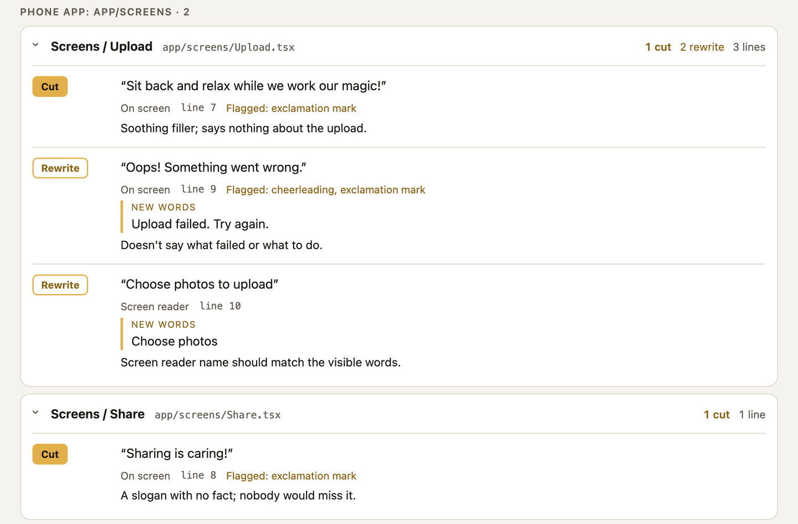
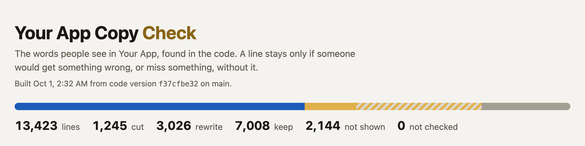

# Justify

A Claude skill that makes every line of words in your product earn its place.

AI writes a lot of product copy now, and a lot of it is slop: "Seamlessly manage your photos", "You're all set!", "Here you can see your settings". It sounds like a product, but nobody would miss it.

Justify finds every line of words your product shows people and asks one question about each:

> Without this line, what would the person get wrong, or not know?

If there's a specific answer, the line stays and the answer is saved as its reason. If not, it's cut or rewritten. Cutting is the default, and vague reasons like "adds clarity" or "builds trust" are rejected.



## What you get

- **A verdict for every line**, saved in your repo at `.justify/verdicts.jsonl`. It's either keep, cut, rewrite or "not shown", with a reason.
- **A one-page report** (`.justify/out/copy-check.html`) with every line grouped by screen, filters, and search. Open it in a browser or share it.
- **New words get checked as you build.** After setup, Claude checks only the lines a change touches, so the list stays current.
- **Mismatch finder.** It finds the same thing named two ways, like "Create story" on one screen and "New book" on another.

## How well it works

Tested with Claude Opus 5.5 at extra high effort on a real app with 13,423 lines of words people see. It cut 1,245 of them, reworded 3,026, and found 461 real bugs along the way, each confirmed by a second check. Lower settings haven't been tested.



**Bonus: it finds bugs.** Every line on screen makes a promise, and checking it means reading the code behind it. That's where bugs show up: a score that read 100% for everyone because nothing measured it, or a message telling people to save a receipt the next screen never showed. Claude lists them in `.justify/bugs.md` instead of fixing them on the spot, so you decide what to fix.

## Install

You need Node 18 or newer and git. Python 3 is only needed for Python projects.

1. Copy this folder to one of these:
   - `~/.claude/skills/justify` to use it in all your projects.
   - `<your repo>/.claude/skills/justify` to use it in one project.
2. Inside that folder, run:

   ```bash
   npm install
   ```

   This installs the TypeScript parser, pinned to version 5.6 so every project is read the same way.

## Use

Open Claude Code in your project and say:

> Set up justify for this project.

Claude will run the first scan, show you what it found by area, and leave out folders people never see (old backups, mockups, test data, internal tools). Then ask for a check:

> Run justify on the settings screens.

> Run a full justify sweep.

Cuts and rewrites are only suggestions until you approve them. When you're ready, say:

> Apply the justify rewrites for the settings screens.

What it saves in your repo:

```
.justify/
  config.json      product name, folders to skip, page link
  verdicts.jsonl   one verdict per line (commit this)
  bugs.md          bugs found while reading the code behind the words
  out/             the built report (ignored by git)
```

`config.json` example:

```json
{
  "product": "Example App",
  "exclude": ["^marketing/old/", "-backup\\."],
  "include": [],
  "platforms": { "^apps/staff/": "admin" },
  "pageUrl": ""
}
```

## What it reads

- JavaScript and TypeScript, including React and React Native screens.
- HTML and page templates: Jinja, Django, Liquid, Handlebars, EJS, and the scripts inside them.
- Python messages: flash messages, errors, API messages, emails.
- Swift string literals and Expo permission prompts.

It skips tests, build output, tooling, migrations, config files, logs, and text sent to AI models.

## Limits

- It reads code, not the running app. Words that come from your database or an AI at run time aren't in the list.
- It doesn't read Kotlin, Java, Go, Ruby, PHP, Vue, Svelte, or Markdown.
- A big app can have 15,000 to 40,000 lines of words people see. A first full sweep takes a lot of AI time. Checking only what a change touches is cheap.
- Some strings people never see still get picked up. Mark them "not shown", or skip their folder in `config.json`.

## Check that it works

```bash
npm test
```

This builds a small test project and checks what the scanner finds.
